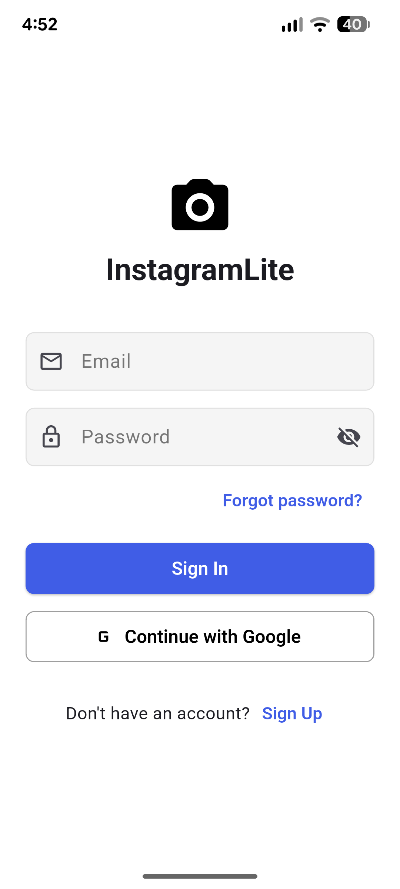
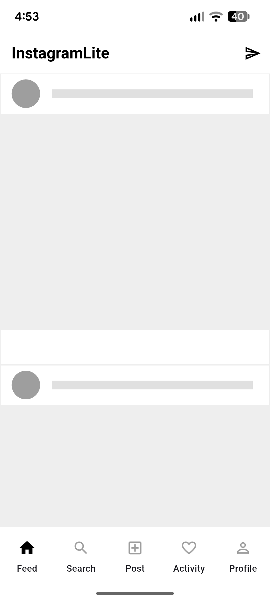
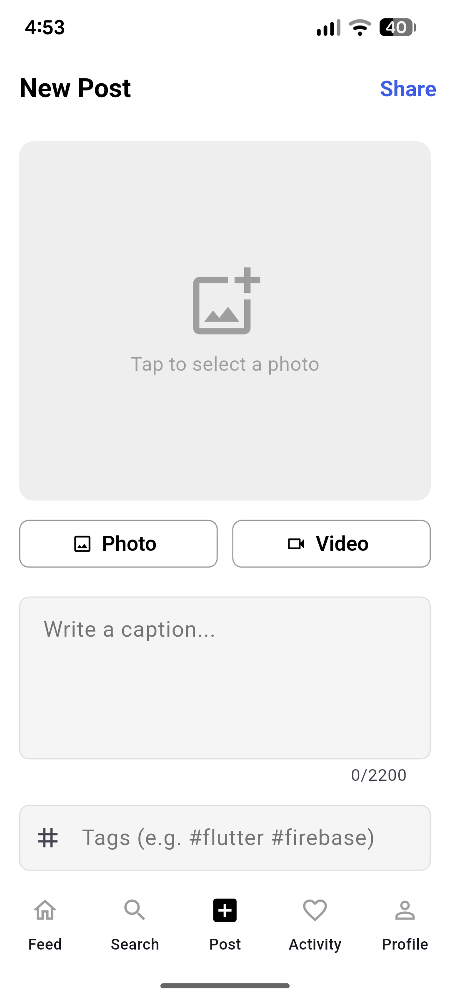

# 📱 InstagramLite — Flutter + Firebase

A full-stack social media mobile application inspired by Instagram, built using **Flutter** and **Firebase**.  
This project demonstrates modern mobile development practices including clean architecture, real-time features, and scalable backend integration.

---

## 📸 Screenshots

| Login | Feed |
|-------|------|
|  |  |

| Search | Create Post |
|--------|-------------|
|  |  |

---

## 🚀 Features

| Feature | Description |
|---------|-------------|
| 🔐 Authentication | Email/Password + Google Sign-In via Firebase Auth |
| 🏠 Feed | Real-time post feed with likes & comments |
| 📸 Create Post | Upload images/videos with captions |
| 🔍 Search | Search and discover users |
| 💬 Real-time Chat | Messaging system with read receipts |
| 🔔 Notifications | Push notifications via Firebase Cloud Messaging |
| 👥 Social | Follow/Unfollow users, view profiles |

---

## 🧠 Tech Stack

### 📱 Frontend
| Technology | Purpose |
|------------|---------|
| Flutter (Dart) | UI Framework |
| Riverpod | State Management |
| GoRouter | Navigation |
| CachedNetworkImage | Image Loading & Caching |

### 🔥 Backend (Firebase)
| Service | Purpose |
|---------|---------|
| Firebase Auth | User Authentication |
| Cloud Firestore | Database |
| Firebase Storage | Media Storage |
| Firebase Messaging | Push Notifications |
| Firebase Realtime DB | Online Presence |

---

## 🏗️ Architecture

This project follows **Clean Architecture** with **MVVM pattern**:
```
lib/
├── core/
│   ├── models/          # Data models (UserModel, PostModel, etc.)
│   ├── repositories/    # Data layer (AuthRepo, PostRepo, etc.)
│   ├── providers/       # Riverpod state providers
│   ├── router/          # GoRouter navigation
│   ├── theme/           # App theme (light/dark)
│   └── services/        # Firebase services
│
├── features/
│   ├── auth/            # Login & Register screens
│   ├── feed/            # Feed screen + widgets
│   ├── profile/         # Profile screen
│   ├── chat/            # Chat list + chat screen
│   ├── create_post/     # Post creation screen
│   ├── search/          # Search screen
│   └── notifications/   # Notifications screen
│
├── shared/
│   └── screens/         # Main scaffold + bottom nav
│
└── main.dart
```

---

## ⚡ Performance Optimizations

- ✅ **Pagination & Lazy Loading** — Cursor-based Firestore pagination
- ✅ **Cached Network Images** — Reduces redundant network calls
- ✅ **Optimistic UI Updates** — Instant like feedback without waiting for server
- ✅ **Efficient Riverpod Providers** — Minimized unnecessary widget rebuilds
- ✅ **Firestore Composite Indexes** — Fast queries on large datasets

---

## 🛠️ Setup Instructions

### 1️⃣ Clone the repository
```bash
git clone https://github.com/your-username/instagram_lite.git
cd instagram_lite
```

### 2️⃣ Install dependencies
```bash
flutter pub get
```

### 3️⃣ Create Firebase project
1. Go to [Firebase Console](https://console.firebase.google.com)
2. Create a new project
3. Enable the following services:
   - **Authentication** → Email/Password + Google
   - **Firestore Database**
   - **Storage**
   - **Cloud Messaging**
   - **Realtime Database**

### 4️⃣ Configure Firebase
```bash
dart pub global activate flutterfire_cli
flutterfire configure
```

### 5️⃣ Add SHA-1 fingerprint (for Google Sign-In)
```bash
keytool -list -v -keystore ~/.android/debug.keystore -alias androiddebugkey -storepass android -keypass android
```
Add the SHA-1 to **Firebase Console → Project Settings → Your Android App**

### 6️⃣ Run the app
```bash
flutter run
```

---

## 🔐 Security

- Firestore Security Rules enforce ownership-based access
- Storage Rules validate file type and size
- Authentication required for all operations
- No sensitive keys committed to repository

---

## 🎯 Future Improvements

- [ ] Stories feature
- [ ] Reels (short videos)
- [ ] Dark mode toggle
- [ ] Advanced search & filters
- [ ] Video calling
- [ ] End-to-end encrypted chat
- [ ] AI-powered content recommendations

---

## 📂 Project Structure Details
```
Each feature follows the same pattern:
feature/
├── screens/    # UI layer
├── widgets/    # Reusable components
├── providers/  # Feature-specific state
└── models/     # Feature-specific models
```

---

## 🤝 Contributing

Contributions are welcome!

1. Fork the repository
2. Create your feature branch (`git checkout -b feature/AmazingFeature`)
3. Commit your changes (`git commit -m 'Add AmazingFeature'`)
4. Push to the branch (`git push origin feature/AmazingFeature`)
5. Open a Pull Request

---

## 📬 Contact

**Vikas Pant**
- GitHub: [@your-username](https://github.com/11iamvikas)
- LinkedIn: [Add your LinkedIn](https://www.linkedin.com/in/vikas-pant-0a4945247/)
- Email: vikaspant6969@gmail.com

---

## ⭐ Show Your Support

If you like this project, give it a ⭐ on GitHub — it helps a lot!

---

*Built with ❤️ using Flutter & Firebase*